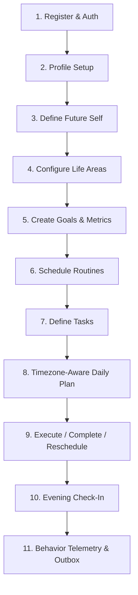

# SAAR Core User Journey Specification (Part 2B)

The complete end-to-end user growth journey connects personal identity, long-term aspirations, daily planning, habit tracking, and reflection.

---

## Step-by-Step Flow

### 1. Register & Authenticate
- **Endpoint**: `POST /api/v1/auth/register`
- **Result**: User record created with argon2 password hash; JWT access token (15m) + rotating refresh token (30d) issued; audit log recorded.

### 2. Profile Setup
- **Endpoint**: `PATCH /api/v1/me`
- **Fields**: `displayName`, `timezone` (e.g. `America/New_York`), `locale`.
- **Significance**: User timezone becomes the authoritative timezone anchor for daily date cutoffs and plan generation.

### 3. Define Future Self
- **Endpoint**: `PUT /api/v1/future-self`
- **Structure**: `futureIdentity`, `horizonYears`, `desiredStates`, `priorities`, `values`.
- **Purpose**: Serves as the North Star identity anchor for goals and routines.

### 4. Life Areas
- **Endpoint**: `GET /api/v1/life-areas`, `POST /api/v1/life-areas`
- **Default Seeding**: Health, Career, Relationships, Family, Personal Growth, Recovery/Rest.
- **Customization**: Weights (0-100), color coding, custom sorting.

### 5. Goals & Metrics
- **Endpoint**: `POST /api/v1/goals`, `POST /api/v1/goals/:id/metrics`
- **Linking**: Connected to a specific Life Area.
- **Quantification**: Target value, current value, units (`km`, `hours`, `count`).
- **Telemetry**: Emits `goal.created` event into Outbox.

### 6. Routines & Recurring Occurrences
- **Endpoint**: `POST /api/v1/routines`, `POST /api/v1/routines/:id/occurrences`
- **Rule**: RFC 5545 recurrence (`FREQ=DAILY`, `FREQ=WEEKLY`).
- **Idempotency**: Daily occurrences tied to `[routineId, localDate]`.

### 7. Tasks & Scheduling
- **Endpoint**: `POST /api/v1/tasks`
- **Ownership Verification**: Automatically validates that linked `goalId`, `lifeAreaId`, and `planId` belong to the same authenticated user.
- **Behavioral Metadata**: `estimatedMinutes`, `priority`, `dueAt`, `scheduledAt`.

### 8. Daily Plan
- **Endpoint**: `GET /api/v1/plans/today`, `POST /api/v1/plans/:id/tasks`
- **Computation**: Timezone-aware local date lookup; dynamically creates or retrieves active plan version.
- **Task Ordering**: Explicit priority ordering within plan.

### 9. Execution
- **Endpoints**:
  - `POST /api/v1/tasks/:id/start` (sets `startedAt`, status: `IN_PROGRESS`)
  - `POST /api/v1/tasks/:id/complete` (sets `completedAt`, status: `COMPLETED`)
  - `POST /api/v1/tasks/:id/reschedule` (increments `rescheduleCount`, updates `dueAt`)
- **Event Outbox**: Each mutation atomically inserts into `behavior_events` and `outbox_events`.

### 10. Check-In & Reflection
- **Endpoint**: `POST /api/v1/daily-growth/checkin`
- **Payload**: `mood` (1-5), `energy` (1-5), `dayRating` (1-5), `reflection`.
- **Score Calculation**: Deterministic daily alignment score computed immediately from task completion, routine completion, and check-in status.

### 11. Behavior Telemetry Stream
- **Endpoint**: `GET /api/v1/behavior-events`
- **Features**: Cursor pagination, date range filtering, event type filtering.
- **Reliability**: Asynchronous consumers read from transactional outbox via `OutboxPublisherService`.
