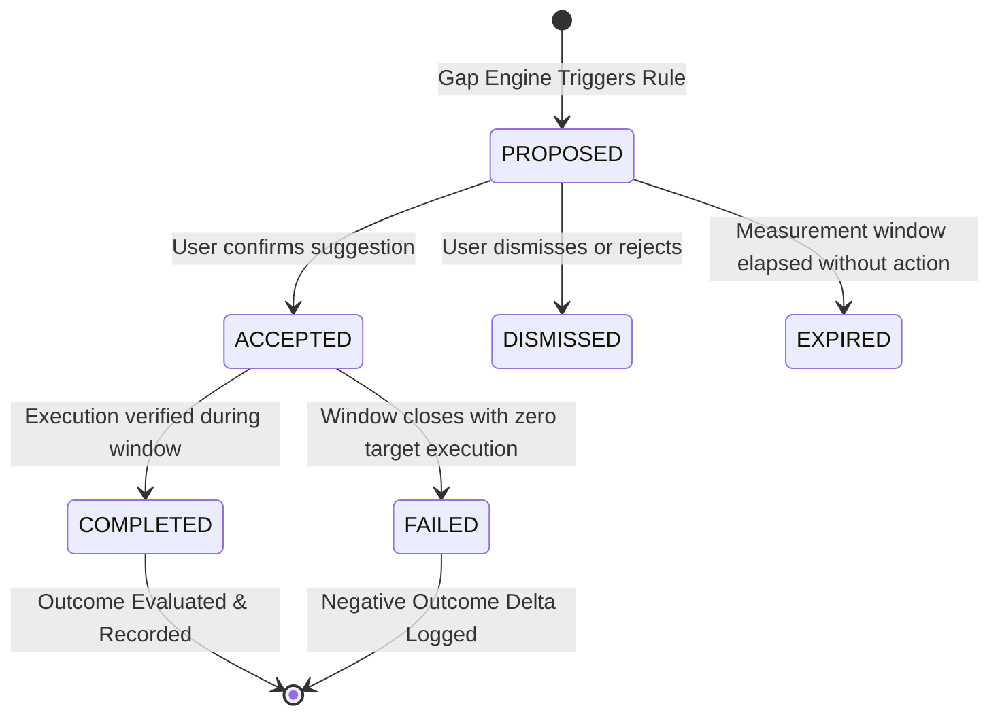

# SAAR Structured Intervention Engine & Outcome Measurement

**Module**: Intervention Engine  
**Version**: `1.0.0`  
**Classification**: Adaptive Closed-Loop Behavioral Interventions  

---

## 1. Mission

The Intervention Engine bridges the gap between diagnosis and behavioral change. When the Gap Engine detects friction, stagnation, or imbalance, the Intervention Engine generates concrete, low-friction, testable adjustments.

Crucially, **interventions are treated as scientific experiments**:
1. Propose intervention with clear evidence and expected outcome.
2. User accepts, rejects, or modifies.
3. User executes within a specified measurement window.
4. Engine evaluates outcome metrics against pre-intervention baselines to compute $\Delta_{outcome}$.

Without outcome measurement, a system cannot determine whether its suggestions actually help or cause friction.

---

## 2. Canonical Intervention Typology

| Intervention Type | Target Condition | Action Required | Expected Outcome |
|---|---|---|---|
| `RESCHEDULE` | Repeated skips due to calendar collisions | Shift task to open high-probability slot | $+25\%$ completion probability |
| `REDUCE_SCOPE` | Tasks scheduled for $>90$ mins repeatedly incomplete | Downscale target duration to 30–45 mins | Overcomes initiation friction |
| `MOVE_TIME` | Low completion rate in morning/evening window | Move task to empirically compatible window | Aligns with natural energy cycles |
| `SPLIT_TASK` | Single monolithic task rescheduled $>2$ times | Break into 2–3 micro-tasks of 15–20 mins | Immediate progress on stalled goal |
| `ADD_BUFFER` | Back-to-back schedule density with zero transition | Insert 15-minute buffer between tasks | Decreases skipped tasks by $40\%$ |
| `RESTORE_ROUTINE` | Routine streak broken or adherence $<50\%$ | Place routine at minimum viable frequency | Restores habit baseline |
| `CREATE_SMALLER_STEP`| Complex goal without task activity for 7 days | Generate single 10-minute starter action | Re-establishes momentum |
| `REFLECT` | Wellbeing drops ($\text{mood} \le 2$ or $\text{energy} \le 2$) for 3 days | Prompt check-in reflection during Daily Growth | Identifies burnout drivers |

---

## 3. Intervention Lifecycle State Machine



### Event Integration
- `intervention.proposed`: Emitted when an intervention is synthesized and written to the database.
- `intervention.accepted`: User accepts the proposed intervention.
- `intervention.rejected`: User declines the proposed intervention.
- `intervention.completed`: Measurement window concludes and outcome evaluation executes.

---

## 4. Outcome Measurement & Learning Loop

Every intervention specifies a **baseline measurement window** (e.g. prior 7 or 14 days) and a **post-intervention evaluation window** (e.g. subsequent 7 days).

### Outcome Calculation Formula

$$\Delta_{\text{outcome}} = M_{\text{post}} - M_{\text{baseline}}$$

Where $M$ is the primary target metric:
- For `REDUCE_SCOPE` / `SPLIT_TASK`: $M$ is task completion rate ($\%$).
- For `MOVE_TIME`: $M$ is completion rate in the new time window ($\%$).
- For `ADD_BUFFER`: $M$ is daily plan adherence rate ($\%$).
- For `RESTORE_ROUTINE`: $M$ is routine occurrences completed count.

### Storage Payload in `Intervention.outcome`
```json
{
  "metricName": "task_completion_rate",
  "baselineValue": 33.3,
  "postValue": 80.0,
  "delta": 46.7,
  "improved": true,
  "measurementWindowDays": 7,
  "evaluatedAt": "2026-10-05T00:00:00.000Z",
  "notes": "Completion rate surged from 33.3% to 80.0% following 30-minute scope reduction."
}
```
